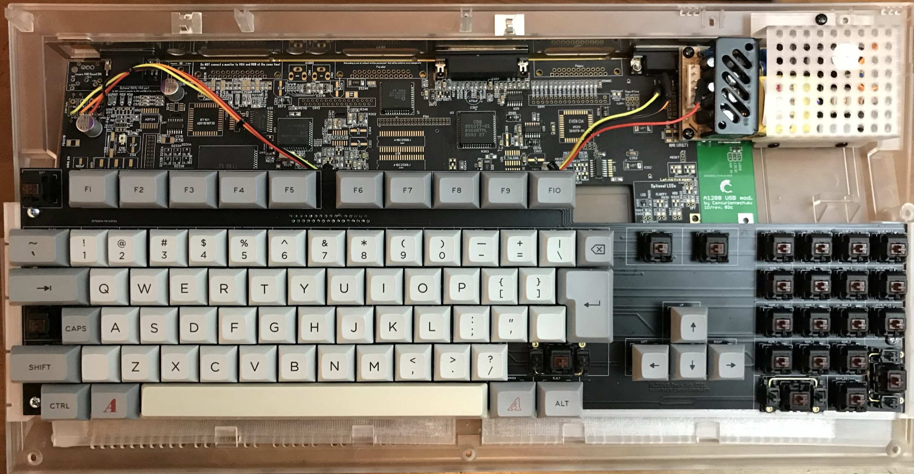
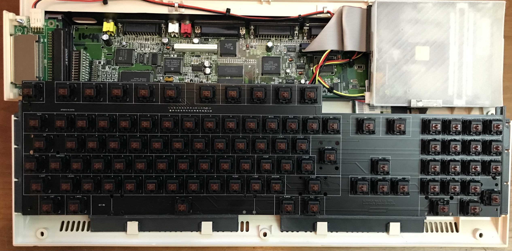

# A1200KB Amiga 1200 mechanical keyboard

As of right now this is revision 4. I know it could be improved very, very slightly by changing the position of key groups by less than a millimetre but I think it's complete now. 

This PCB design was reverse-engineered from the original keyboard in an Amiga 1200. It is designed to connect to your Amiga 1200 with no modifications to the original machine, just take out the original keyboard and store it away safely. If you want an A600 keyboard, see my other repositories.

The A1200.net case (with internal PSU and partially-completed [ReAmiga](http://www.reamiga.info/) board)

The original Amiga case (with CF disk system and transparent floppy cover)

## Requirements
To make a working keyboard for your Amiga 1200, you need:

- one PCB (this project)
- MX-compatible PCB-mount keyswitches, one for each key
- one LED (caps lock)
- one FFC connector, 32-way RA 1.25mm pitch. Molex 52044-3245 is one example, available from Mouser Electronics.
- one FFC ribbon cable, 32-way, 1.25mm pitch. Molex 15168-0400 is one example, available from Mouser Electronics.
- keycaps
- some way to mount the keyboard inside the Amiga (3D print some brackets from the STL folder...)
 
## Design
The Amiga 1200 keyboard is a simple passive key matrix connected via a 31-conductor cable. Some special keys are not on the matrix but have a dedicated circuit, such as the CTRL and Amiga keys - this is why so many conductors are necessary. The original Amiga 1200 PCB uses a 31-way FFC connector, I was not able to buy this anywhere as they are long discontinued. However cutting one conductor away from the cable allows it to fit in the Amiga connector with 31 conductors and to the keyboard with 32 conductors and everything is fine. The specified FFC cable is slightly longer than required but in 2019 there is not  a lot of choice available, so the longer one will do. 
I had my boards made with 1.6mm PCB substrate as any other thickness gets disproportionally expensive, no other special options. Using a piece of aluminium rail, 10x3mm, will make it as stiff as a keyboard should be while maintaining enough space underneath for an accelerator or Indivision etc. This is supported either side by the 3D printed mounts. Cover the aluminium with some kapton or other insulation if you have other internal components that may come dangerously close but in a stock Amiga there is plenty of clearance.

### Amiga Keycaps
These aren't widely available. I've tried making some using a blank set of keycaps from aliexpress and a laser etcher, but I do not know of anywhere that sells a MX-stem set of Amiga keycaps. I am using a 9U space bar but you can just as easily use 7U. If gaps either side of the space bother you, 3D print something to fill the space.

If you want a perfect set of keys, visit pimpmykeyboard.com - it will not be cheap but if you look hard enough you will find every key, even the Amiga keys, and you can have any legend printed on any size keycap so it is possible to make a perfect set. It will not be cheap. You can se a partial sample in the A1200.net picture. I am currently waiting for the extra numpad keys to arrive to complete this keyboard.

## Construction
Without going into all the detail here - as there is lots of detail on www.grayunicorn.com - I rate this a mid-level project. There is no power, no delicate soldering, and nothing can really be inserted the wrong way. Mounting the keyboard requires 3D printing the files you will find in the 3Dfiles folder.

If you have a replacement case produced by A1200.net then pick that folder, else the other folder. I don't know about cases made by ESCOM but I don't think they are at all different from the Commodore cases. I printed these in PETG, 0.4mm nozzle, 0.2mm layer height, supports are necessary. Mounting the keyboard with these designs allows the use of an accelerator card with a thick SIMM; I may design alternates if I get a slimmer accelerator, bringing the keys further back into the case but there is not much room.
 
You can damage your Amiga if you don't know what you are doing. Please be careful and if you are not experienced in projects like this get some help, maybe vist your local makerspace, and don't hurt yourself or your computer.

## Share
Most of all - if you have any suggestions for improvements, adding an issue or a pull request to this repo would be much appreciated. And share your project with the Amiga community, I'd really like to see what you made.

#### Donate?
I hate to think what this has cost so far. It's been fun and I'd do it again, but if you'd like to help the next project happen that would be awesome.

